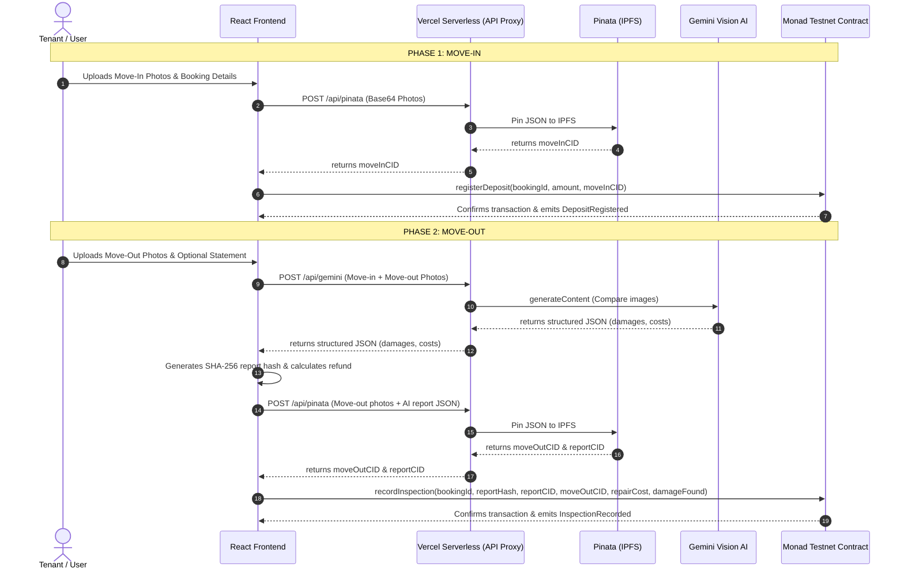

# 🛡️ RentGuard

> **Trustless, AI-powered rental escrow & damage assessment registry on the Monad blockchain.**

---

## 🔗 Links
*   **Live Demo**: [https://rent-guard-beta.vercel.app/](https://rent-guard-beta.vercel.app/)
*   **Smart Contract Address**: [`0xd9145CCE52D386f254917e481eB44e9943F39138`](https://testnet.monadscan.com/address/0xd9145CCE52D386f254917e481eB44e9943F39138)
*   **Monad Explorer Link**: [Monadscan Address Registry](https://testnet.monadscan.com/address/0xd9145CCE52D386f254917e481eB44e9943F39138)

---

## 📌 Project Overview
### What problem RentGuard solves
Security deposit disputes are one of the most common friction points in the rental housing market. Landlords hold absolute veto power over tenant deposits, often keeping large portions under the guise of "repairs" for normal wear-and-tear or pre-existing damages. Tenants lack a transparent, tamper-proof audit trail or a neutral mediator.

### Why it matters
RentGuard democratizes and automates the escrow and condition verification process. By combining the low-cost finality of the Monad blockchain alongside Gemini Vision AI and IPFS, it establishes an immutable, evidence-backed record of the property's condition at both move-in and move-out. Disputes are resolved mathematically based on automated comparisons, bypassing human bias.

---

## ✨ Key Features
*   **Wallet Authentication**: Simple Web3 onboarding using MetaMask/Rabby connected to the Monad Testnet.
*   **AI Damage Assessment**: Leverages Gemini Vision AI (`gemini-2.5-flash`) via secure serverless endpoints to detect new damages and estimate repair costs.
*   **IPFS Evidence Storage**: Room photos are pinned to IPFS (via Pinata) at check-in and check-out, returning cryptographic CIDs.
*   **On-Chain Inspection Registry**: Deposit details, inspection reports, and evidence CIDs are immutably registered on-chain in the Solidity contract.
*   **Automated Refund Calculation**: Automatically computes tenant refunds based on pre-registered deposits minus AI-estimated damages (`Deposit - RepairCost`).
*   **Tamper-Evident Reports**: Saves deterministic SHA-256 hashes of generated AI inspection reports on-chain, ensuring reports cannot be modified after the fact.

---

## 🏗️ Architecture Diagram
### Visual System Flow: React ➔ Gemini ➔ IPFS ➔ Monad


---

## ⚙️ System Architecture
*   **Frontend**: Single Page React 19 app bootstrapped with Vite, styled with Tailwind CSS v4. Managed entirely in `/app/src`.
*   **AI Layer**: Gemini 2.5 Flash model queried through a Vercel serverless function (`/api/gemini`) to protect API keys.
*   **Decentralized Storage**: Pinata handles IPFS uploads. Securely queried server-side through `/api/pinata` to hide JWT secrets.
*   **Smart Contract Layer**: Solidity contract `EscrowInspectionRegistryV2` deployed on Monad Testnet to store immutable mapping records.

---

## 🔄 End-to-End Workflow
1.  **Wallet Connection**: Tenant lands on the dashboard and connects their wallet to Monad Testnet.
2.  **Move-In**: User takes photos of the property, uploads them, and keys in their Booking ID & deposit amount. The images are archived, and `registerDeposit` locks the contract status.
3.  **AI Analysis**: At checkout, the user uploads move-out photos. The app feeds both check-in and check-out photos to Gemini Vision.
4.  **Report Generation**: Gemini produces a damage report which is hashed client-side to yield a unique fingerprint.
5.  **On-Chain Finalization**: The tenant initiates a blockchain tx calling `recordInspection`, storing the report hash, CID archives, and damages on-chain.

---

## 📸 Screenshots / Demo GIF

#### Home Page
 *(Placeholder)*

#### Property Selection
 *(Placeholder)*

#### Move-In Flow
 *(Placeholder)*

#### Move-Out Flow
 *(Placeholder)*

#### Inspection Report
 *(Placeholder)*

---

## 📄 Smart Contract Design

### Contract Purpose
To act as the trustless source of truth mapping unique booking identifiers to their deposits, statuses, and inspection reports.

### Main Structs
```solidity
struct Deposit {
    uint256 amount;
    address tenant;
    uint256 timestamp;
    string moveInCID;      // IPFS CID for move-in evidence
    bool exists;
}

struct InspectionResult {
    bytes32 reportHash;    // Hash of AI inspection report
    string reportCID;      // IPFS CID of full report JSON
    string moveOutCID;     // IPFS CID for move-out evidence
    uint256 repairCost;
    bool damageFound;
    uint256 timestamp;
    bool exists;
}
```

### Events
*   `event DepositRegistered(string indexed bookingId, address indexed tenant, uint256 amount, string moveInCID, uint256 timestamp)`
*   `event InspectionRecorded(string indexed bookingId, bytes32 indexed reportHash, string reportCID, string moveOutCID, uint256 repairCost, bool damageFound, uint256 timestamp)`
*   `event StatusUpdated(string indexed bookingId, RentalStatus status)`

### State Flow
```text
[ Vacant ] ➔ registerDeposit() ➔ [ Occupied ] ➔ recordInspection() ➔ [ Inspected ]
```

---

## 📦 IPFS Storage Design

### Why IPFS
Traditional databases can be modified or deleted. IPFS ensures content-addressed, permanent, and decentralized evidence storage.

### What gets stored
1.  **Move-in Condition Evidence**: Base64 photos bundled into JSON.
2.  **Move-out Condition Evidence**: Base64 photos bundled into JSON.
3.  **AI Inspection Report**: Complete audit report metadata JSON.

### CID lifecycle
CIDs are generated by Pinata on upload, passed to the client, and written directly to the Monad contract storage, linking the blockchain transaction to the permanent physical evidence.

---

## 🧠 AI Inspection Pipeline

### Gemini Input
The system takes system prompts instructing the model as a professional inspector, followed by base64 arrays of move-in (reference) vs move-out (current checkout) photos.

### Gemini Output Schema
```json
{
  "damageFound": "boolean",
  "damageDescription": "string",
  "estimatedRepairCost": "number"
}
```

### Refund Calculation Logic
$$\text{Refund Amount} = \max(0, \text{Deposit Amount} - \text{Estimated Repair Cost})$$

---

## 🛠️ Tech Stack
*   **Frontend**: React 19, Vite, Tailwind CSS v4, Ethers.js
*   **Blockchain**: Monad Testnet (RPC: `https://testnet-rpc.monad.xyz`)
*   **AI**: Gemini 2.5 Flash
*   **Storage**: IPFS (via Pinata)
*   **Wallet**: MetaMask / Rabby / EIP-1193 wallets
*   **Deployment**: Vercel

---

## 🔒 Security Considerations
*   **User-Signed Transactions**: Users review and sign transactions using their wallets. The app has no access to seed phrases or private keys.
*   **No Private Key Custody**: Fully non-custodial Web3 integration.
*   **Immutable Audit Trail**: Once logged to Monad, CIDs and damage estimates cannot be overwritten or modified by landlords.
*   **Content-Addressed Storage**: CIDs guarantee that the photos and reports cannot be secretly swapped out or altered.

---

## 📁 Project Structure
```text
/
├── README.md                 <- System documentation
├── vercel.json               <- Vercel deployment & serverless config
├── app/                      <- Frontend source code
│   ├── api/                  <- Vercel Serverless API Functions
│   │   ├── gemini.js         <- Gemini API proxy
│   │   └── pinata.js         <- Pinata API proxy
│   ├── src/                  <- React components, pages & state
│   │   ├── components/       <- Reusable UI (ImageUploader, Navbar, etc.)
│   │   ├── pages/            <- Main views (HomePage, PropertiesPage, MoveIn, MoveOut)
│   │   └── utils/            <- ABI files, Pinata/Gemini helpers
│   ├── .env                  <- Environment variables configuration
│   └── package.json          <- Node dependencies
└── contracts/                <- Solidity Smart Contract project
    └── contracts/
        └── ContractV2.sol    <- Registry smart contract
```

---

## 🚀 Local Development Setup

### Prerequisites
*   Node.js (v18+)
*   npm or yarn

### Installation
```bash
cd app
npm install
```

### Environment Variables
Create a `.env` file in `/app`:
```env
VITE_REGISTRY_CONTRACT_ADDRESS=0xd9145CCE52D386f254917e481eB44e9943F39138
GEMINI_API_KEY=your_gemini_api_key
PINATA_JWT=your_pinata_jwt_token
```

### Running Locally
To run both the serverless API endpoints and Vite frontend locally:
```bash
npx vercel dev
```
Open `http://localhost:3000` (or the local port outputted by Vercel) in your browser.

---

## 🌍 Deployment Information

### Monad Network Details
*   **Network Name**: Monad Testnet
*   **RPC URL**: `https://testnet-rpc.monad.xyz`
*   **Chain ID**: `10143`
*   **Currency Symbol**: `MON`

### Contract Address
*   `0xd9145CCE52D386f254917e481eB44e9943F39138`

### Deployment Steps
1.  **Contract**: Paste `/contracts/contracts/ContractV2.sol` in Remix (removing code fences), configure MetaMask for Monad Testnet, compile, and deploy.
2.  **Frontend**: Link your repository to Vercel. Set `GEMINI_API_KEY` and `PINATA_JWT` as Environment Variables in your Vercel project settings, then deploy.

---

## 🔮 Future Improvements
*   **Real Escrow Fund Locking**: Integrate smart contracts to hold real tokens (MON / stablecoins) in escrow and auto-distribute them upon inspection approval.
*   **Dispute Resolution**: Implement a decentralized arbitrator pool (e.g. Kleros) to resolve edge cases where AI fails or users dispute AI assessments.
*   **Reputation System**: Rate tenants and landlords on-chain based on timely settlement history.
*   **Multi-Property Support**: Add dashboarding and multi-tenant management interfaces for professional property managers.
