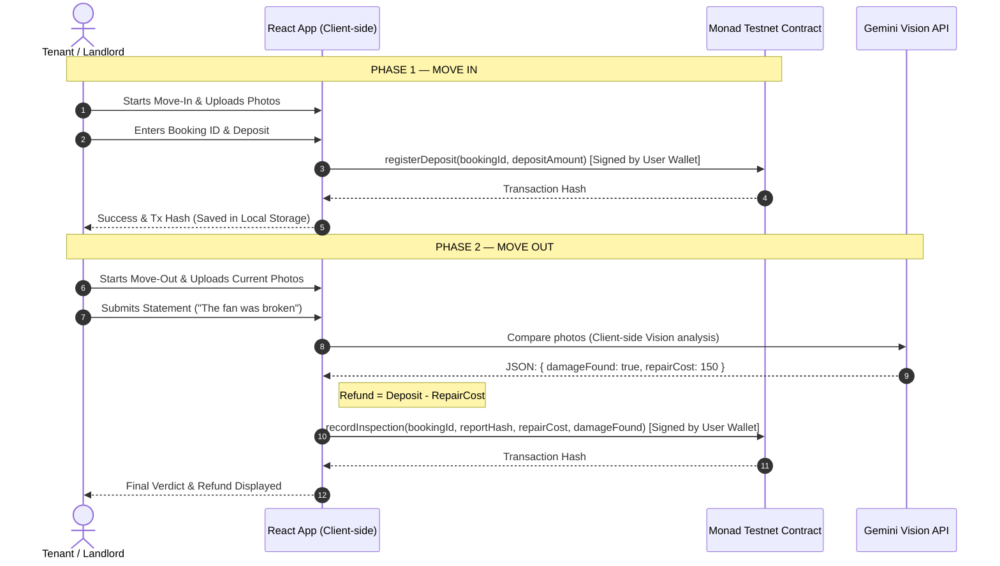

# 🛡️ RentGuard
> **Trustless Rental Escrow & Damage Settlement Powered by Monad and Gemini Vision.**

[](https://testnet.monadscan.com)
[](https://ai.google.dev)
[](https://github.com)

---

## 📌 The Problem
In the rental housing market, **security deposit disputes are a major friction point**. Landlords hold absolute veto power over the deposit. Upon move-out, tenants are often hit with unfair deductions for "damages" (which are frequently normal wear-and-tear or pre-existing issues). There is no unbiased, third-party source of truth.

## 💡 The Solution
**RentGuard** is an AI-powered rental escrow registry that protects both parties by creating a cryptographically secure, auditable property lifecycle.

1. **Wallet Connection Gate**: The tenant connects their Web3 wallet (e.g. MetaMask) on Monad Testnet to browse active property listings.
2. **Move-In**: The tenant uploads proof-of-condition photos. The security deposit registration is signed and logged directly on the **Monad blockchain** under a unique Booking ID.
3. **Move-Out**: The tenant uploads checkout photos and optionally submits a statement.
4. **Gemini Vision**: The app compares the move-in and move-out photos client-side directly via the Gemini API to detect new damages and estimate repair costs.
5. **On-Chain Settlement**: The final report hash, repair cost, and damage status are committed to the Monad contract directly via the tenant's connected wallet, recommending a trustless refund calculation.

---

## 🏗️ Architecture & Workflow



---

## 🛠️ Tech Stack

*   **Blockchain**: **Monad Testnet** (for high throughput, sub-second finality, and low transaction costs).
*   **Smart Contracts**: **Solidity** compiled and deployed using **Remix IDE**.
*   **Vision AI**: **Gemini 2.5 Flash** (performing property condition comparisons client-side with rigid JSON schema outputs).
*   **Frontend / Interface**: **React 19**, **Vite**, and **Tailwind CSS v4** (styled using custom Pop-art / Neo-Brutalist themes).
*   **Image Compression**: Client-side **HTML5 Canvas Compression** (resizes and optimizes photos to base64, keeping localStorage under limits).

---

## 📦 Smart Contract Details
Deployed on **Monad Testnet** at address:
👉 **[`0xd9145CCE52D386f254917e481eB44e9943F39138`](https://testnet.monadscan.com/address/0xd9145CCE52D386f254917e481eB44e9943F39138)**

### ABI Signature Functions
```solidity
function registerDeposit(string calldata bookingId, uint256 depositAmount) external;
function recordInspection(string calldata bookingId, bytes32 reportHash, uint256 repairCost, bool damageFound) external;
```

---

## 🚀 Getting Started

### 1. Prerequisites
Ensure you have Node.js (v18+) and npm installed.

### 2. Configure Environment Variables
Create a `.env` file inside the `app/` directory:
```env
VITE_GEMINI_API_KEY=your_gemini_api_key
VITE_REGISTRY_CONTRACT_ADDRESS=0xd9145CCE52D386f254917e481eB44e9943F39138
```

### 3. Installation
Install app dependencies:
```bash
# Go to app/
cd app
npm install
```

### 4. Running Locally
Start the Vite development server:
```bash
# In app/
npm run dev
```
Open `http://localhost:5173` in your browser. Ensure your Web3 wallet is connected to **Monad Testnet** (Chain ID: `10143`).
